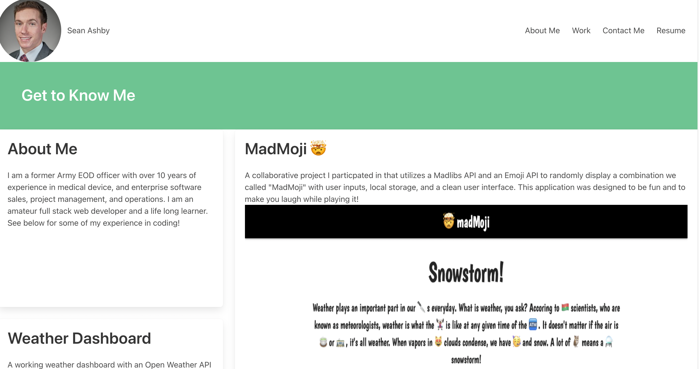

# My-Portfolio
As a new, up and coming developer, I want to create a porftolio that displays my experience and work to potential employers that ensures that I will be a good fit for any position I am being considere for. My portfolio will not only show my accomplishments but highlight who I am as a person to give a holistic view of my ability to contribute to a team, culture, and ability to perform. 

Here I used BULMA CSS to design a responsive website which displays my accomplishments thus far in the coding bootcamp. I'm actually proud of the changes I've made compared to my first submission. I used NPM install commands to download BULMA CSS which allows me to design a responsive website with less code easier. 

<!-- need to update photo path -->
  

<!-- need to update deployed application link  -->
Link [Deployed application](https://seanrashby.github.io/My-Portfolio/)